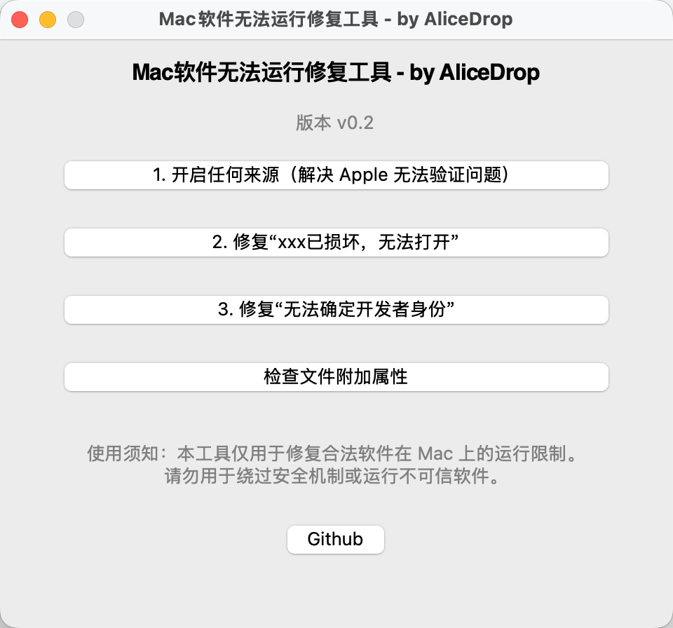

# Mac软件无法运行修复工具 - by AliceDrop

修复macOS运行第三方方式下载的软件被阻止运行。

## 原理

### macOS拒绝运行与应对策略

mac上默认会执行检查软件（.app）的签名、来源等，在macOS 10.15之后还会强制检查软件公证情况，如果不满足就会提醒并拒绝运行，比如

“Apple无法验证“XXX.app”是否包含可能危害Mac安全或泄漏隐私的恶意软件。”（未公证）

“无法打开“ XXX”，因为无法确定开发者的身份。”（签名存在问题）

这些问题只要打开任何来源就可以解决。在macOS 10.15之后隐藏了该选项，需要通过终端输入一行指令`sudo spctl --master-disable`手动开启，或者使用软件代为执行这个来开启。

开启了这个之后，确实是所有这些问题都不会有了，用户真正掌握它可以正常使用了，除了另外一种情况，就是macOS的系统追踪来源用的附加属性出现问题。

macOS对网络上下载来的文件，会打上隔离附加属性com.apple.quarantine来标记，并且该属性中还会有一些详细数据，包含了到系统记录相关行为的日志数据库的键。

如果这个文件是在别的电脑上被下载的，然后传输给你，就可能出现保留了别人电脑打上的隔离附加属性，里面的键自然无法正确对应你电脑上的数据库中的信息，就会被视为文件损坏，拒绝运行。

这种情况直接去除软件的隔离附加属性就行了。使用`sudo xattr -rd com.apple.quarantine <软件路径>`即可。

## 使用须知：

本工具仅用于修复合法软件在 Mac 上的运行限制。请勿用于绕过安全机制或运行不可信软件。